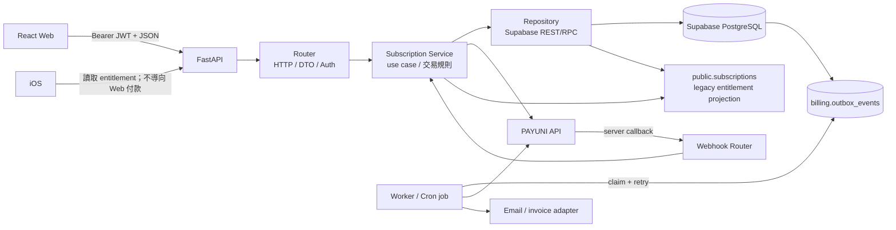
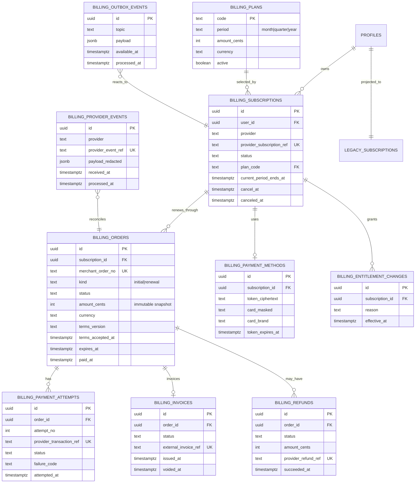
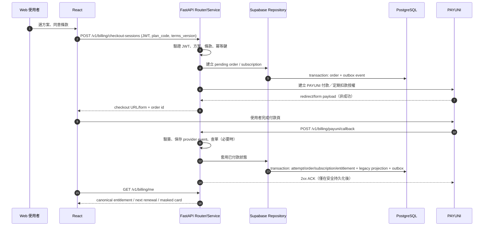
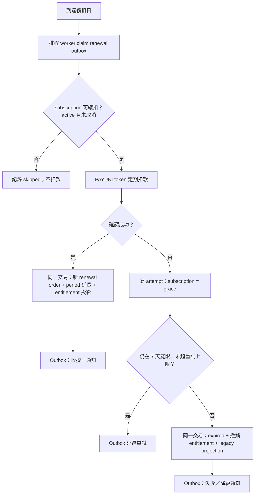
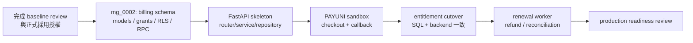

# PAYUNI 定期扣款訂閱：過渡期功能規格

> 狀態：**Draft — P1 schema 已實作，尚未可對外收款**
> Owner：待指定
> 基線：`feat/alembic-orm-baseline` 的 `mg_0001_baseline`
> 最後更新：2026-09-24

## 1. 目的與邊界

本規格為 MindGym 建立第一條 FastAPI 垂直切片：網站前端透過 FastAPI 建立
PAYUNI 信用卡定期扣款訂閱；FastAPI 以 repository 層透過 Supabase/PostgREST
存取 PostgreSQL。這是過渡架構，**不是**現在就把資料庫改成 FastAPI 直連或
DDD。

首版提供月／季／年方案、付款、續扣、取消、付款失敗寬限與退款；Apple IAP
在本規格只保留權益整合邊界，**不實作 Apple 購買與續訂**。iOS App 不得導向
網站付款頁，並須依 App Store 規範另立 IAP 規格與流程。

電子發票必須有「何時建立、失敗如何重試、如何和訂單對帳」的可稽核紀錄；首版
可將開立動作交給既定的發票服務 adapter，但不可只在付款成功後 fire-and-forget
而不留狀態。

本規格不包含：Google Play Billing、分潤、發票實作細節、既有全功能免費策略的
即刻結束、將所有既有 FastAPI endpoint 重寫，或把 Alembic baseline 部署到正式
Supabase。

## 2. 已知現況與必須先校正的事實

| 現況 | 意義 | 此功能的處理 |
| --- | --- | --- |
| `mg_0001_baseline` 是本機限定、尚未正式接管的 snapshot | 不能拿它直接對正式庫 `upgrade` | 正式採用／版本登記必須先被明確授權；新功能只能新增 revision，絕不能改寫 `mg_0001`。 |
| `public.subscriptions` 每人一列 | 它是既有權益投影，沒有訂單、交易、token 或 webhook 審計 | 保留相容；新 `billing` 資料才是付款與訂閱真相來源。 |
| `pricing_config` 只有月／年與目前展示價格 | 價格可變，不可作為歷史訂單唯一證據 | 新訂單必須存不可變的方案／價格／稅額快照；季繳需另補方案。 |
| `is_pro()` 與 `backend/app.py::_subscription_tier()` 目前讓全部登入者為 Pro | 真金流上線後仍會全數解鎖 | 啟用收費牆前，兩者必須同一版改為讀取 canonical entitlement。 |
| 前端仍直接使用 Supabase | 付款資料若暴露給 browser，容易越權或竄改 | 金流寫入一律只走 FastAPI；browser 不取得 provider token、回呼資料或管理資料。 |

## 3. 目標架構（過渡期）

### 3.1 三層責任

| 層 | 建議位置 | 只負責 | 不負責 |
| --- | --- | --- | --- |
| Router | `backend/routers/billing.py` | JWT 驗證、request/response DTO、HTTP status、callback route | 付款狀態轉換、SQL／Supabase URL 拼接 |
| Service | `backend/services/subscriptions.py` | 建單、啟用、續扣、取消、退款、冪等與權益規則 | FastAPI `Request`、HTTP transport 細節 |
| Repository | `backend/repositories/billing.py` | 透過 Supabase REST/RPC 讀寫、交易型 RPC 呼叫 | PAYUNI 規則、回傳給前端的業務決策 |

`backend/app.py` 在此切片只保留 application factory、lifespan、middleware 與
`include_router()`；既有 endpoint 不在本次搬遷範圍。PAYUNI SDK／HTTP 呼叫應封裝為
`backend/integrations/payuni.py`，不可散落在 router 或 repository。

### 3.2 資料與權限原則

1. `billing` 是新 schema，Alembic 必須顯式納管它；不可只擴充 `public.subscriptions`
   就宣稱可稽核金流。
2. `billing` 不在瀏覽器 Supabase API 的 exposed schemas；只有 FastAPI 的 service
   role / 受限 runtime role 可存取。若技術上必須 expose 給 PostgREST，仍須 revoke
   `anon`、`authenticated` 權限並驗證 RLS，且不得提供 client 寫入入口。
3. 不儲存卡號、CVV 或完整卡片有效期限。只存 PAYUNI 回傳且營運必要的 token
   reference、遮罩卡號／卡別等最小資料；token 若可用於扣款，必須加密、限制讀取
   與列入秘密／輪替策略。
4. PAYUNI 是「支付結果」的外部權威；本系統以驗簽、查單與冪等處理後的
   `billing` 記錄為內部稽核權威；`public.subscriptions` 只是相容投影。

## 4. 建議資料模型

下列是 `mg_0002_billing_recurring` 的設計目標，欄位名稱可在實作前與 PAYUNI
實際 contract 對齊，但狀態、唯一鍵與不可變快照不可省略。

### 4.1 必要約束與索引

- `merchant_order_no` 全域唯一且由伺服器生成；取消／逾時後重新付款必定建新單，
  不重用 PAYUNI 商店訂單編號。
- 一個 user 同時最多一筆 `pending` 初始訂單（partial unique index），但先查單後
  才能決定續用、作廢或重建。
- `provider_event_ref`、`provider_transaction_ref`、退款 provider reference 均唯一，
  保證 webhook、輪詢與人工重送不會重複開通／退款。
- `amount_cents`、`currency`、方案名稱快照寫入訂單後不可更新；改價只影響新訂單。
- 每張初始訂單必須帶 `terms_version`、`terms_accepted_at` 與可稽核的同意來源；
  不能以「目前頁面有顯示條款」替代同意紀錄。
- `billing.invoices` 的狀態與外部發票號需可與 order 對應；發票建立／作廢失敗須透過
  outbox 重試或進人工處理，不能阻塞已確認的付款 callback。
- 所有時間使用 `timestamptz`；狀態轉換需由 service + 單一 transaction/RPC 執行，
  不可由 client PATCH。

### 4.2 既有表的處置

| 既有物件 | 決策 |
| --- | --- |
| `public.pricing_config` | 過渡期可當展示設定來源；付款建立時改由 service 讀取受控 `billing.plans`（或同步後的唯讀來源）並 snapshot。 |
| `public.subscriptions` | 維持前端與既有 SQL/RPC 相容。每次 entitlement change 在**同一個 DB transaction** upsert 此投影，不能手動雙寫。 |
| `paywall_intents` | 保留產品分析；不得當成付款成功或授權扣款的證據。 |
| `is_pro()`／`get_my_entitlements()`／`_subscription_tier()` | 在收費牆正式開啟的同一 release 改為讀 canonical entitlement；三者以整合測試鎖住一致性。 |

## 5. 主要流程

### 5.1 首次訂閱與回呼

**關鍵規則**：前端導回成功頁、PAYUNI browser redirect 與 callback 都不是權益
開通依據。只有伺服器驗簽後已持久化的 provider event，加上需要時的 PAYUNI
查單結果，才能把狀態改為 `active`。

### 5.2 自動續扣、失敗與寬限

- 重試次數、間隔、PAYUNI token 的有效／失效語義必須以 PAYUNI 核准的 merchant
  contract 定義，寫入設定而非散落在程式碼。
- worker 以 `FOR UPDATE SKIP LOCKED`（或等效 Supabase RPC）claim outbox；每件工作
  要有 lease、attempt count、backoff、dead-letter／人工處理狀態。
- 不可把付款 HTTP 呼叫包在長時間資料庫 transaction；先持久化意圖，再呼叫 provider，
  結果以 idempotent transaction 套用。

### 5.3 使用者取消、退款與對帳

| 情境 | 系統行為 | 權益何時變更 |
| --- | --- | --- |
| 使用者取消自動續扣 | 向 PAYUNI 取消 token／定期扣款，保存結果；`cancel_at = current_period_ends_at` | 已付款當期保留到期日，不立即降級。 |
| 7 日一般退款 | 管理端發起，先呼叫 PAYUNI；只有 provider 成功才記成功退款與取消續扣 | 成功退款 transaction 內立即撤銷 entitlement。 |
| 重複／錯誤扣款 | 依客服審核與 PAYUNI 結果處理；不可只靠管理 UI 改 DB | 依退款成功結果執行，保留完整 audit。 |
| 24 小時未完成付款 | worker 先查 PAYUNI 再將訂單標逾時；晚到成功改為 paid 並標記 anomaly | 查單確認前不將 pending 視為失敗；確認 paid 才開通。 |
| 每日對帳 | 匯入／查詢 provider 結果，比對 orders、attempts、refunds | 不自動覆寫衝突；建立 anomaly 與通知，供人工處理。 |

付款成功後發票 adapter 的工作也由 outbox 觸發。invoice 失敗是需要告警與重試的帳務
異常，但不應倒回已經由 PAYUNI 確認的付款／訂閱權益；除非甲方另定義法遵上的
阻斷規則。

## 6. API 契約（第一版）

所有 `/v1/billing/*` 的 client API 經 FastAPI。使用者 ID 永遠從 JWT 取得，request
body 不得帶 `user_id`。`Idempotency-Key` 為建立 checkout、取消與退款的必要 header。

| 方法與路徑 | 呼叫者 | 目的 | 回傳要點 |
| --- | --- | --- | --- |
| `GET /v1/billing/plans` | public web | 可販售方案 | code、展示名稱、價格、幣別、period、條款版本 |
| `POST /v1/billing/checkout-sessions` | 已登入 Web | 建立初始訂單與 PAYUNI 導轉資料 | order id、status、provider redirect/form、expires_at |
| `GET /v1/billing/orders/{id}` | 本人 | 輪詢付款狀態 | order status、paid_at、可否 resume |
| `POST /v1/billing/orders/{id}/resume` | 本人 | 查舊單後續用或新建單 | checkout session 或已付款狀態 |
| `POST /v1/billing/subscription/cancel` | 本人 | 關閉未來自動續扣 | status、current_period_ends_at、cancel_at |
| `GET /v1/billing/me` | 本人／iOS | 訂閱、權益、付款歷史的安全視圖 | tier、status、effective_until、next_charge_at、masked card、orders |
| `POST /v1/billing/payuni/callback` | PAYUNI | server-to-server 付款通知 | 僅 ACK；不回傳帳務細節 |
| `POST /v1/admin/billing/refunds` | admin | 發起退款 | refund id、processing／succeeded／failed |
| `GET /v1/admin/billing/reconciliation` | finance admin | 對帳清單、異常與匯出 | read-only paginated result |

PAYUNI callback 的實際參數、驗簽欄位、ACK body、IP allowlist、timeout、查單 API
與 token 建立／續扣 contract 必須以已核准的 PAYUNI 商戶技術文件補入附錄；在取得
文件前不得以猜測欄位實作或測試正式扣款。

## 7. Alembic 與 Supabase 的落地順序

1. 將 baseline 正式採用視為獨立 change；它目前會阻止 non-loopback URL 與 `stamp`，
   這些保護不可為了付款而移除。
2. 新增 `mg_0002_billing_recurring`，建立 `billing` schema、表、索引、最小權限、
   RLS／受控 RPC、資料 migration（如需要）與 `billing.outbox_events`；不得修改
   baseline assets 或 `mg_0001_baseline.py`。
3. 擴充 `backend/database/models.py` 與 `backend/database/scope.py`，讓 Alembic 明確
   對 `billing` schema 有 ownership；同時新增 head-level catalog verifier，不能改寫
   `verify_baseline.py` 的 0001 期望。
4. 先完成 sandbox 的建單、callback 冪等、權益投影整合測試，再啟用真實 paywall。
5. 待 PAYUNI 定期扣款 contract、固定 egress IP、callback 公網 HTTPS、秘密管理、
   發票責任與營運值班均已備妥，才實作／啟用續扣 worker。

## 8. 驗收條件

- [ ] 新 migration 可在新的本機 Supabase 從 `mg_0001` 升到 head，重跑無副作用。
- [ ] 無 JWT、他人 JWT 與 browser Supabase client 都無法讀寫付款 token、callback、
      訂單或退款資料。
- [ ] 同一 `Idempotency-Key` 反覆建立 checkout 只產生一張有效訂單；同一 PAYUNI
      callback 重送不會產生兩次付款、兩段權益或兩封通知。
- [ ] callback 偽造／驗簽失敗／未知訂單均不開通權益，且可被安全稽核。
- [ ] 付款成功、失敗、取消、退款、24 小時逾時與晚到成功都有狀態轉換測試。
- [ ] 條款版本與同意時間可由訂單稽核；發票建立／作廢的成功、失敗與重試狀態可對帳。
- [ ] `billing` canonical entitlement、`public.subscriptions`、`is_pro()`、
      `get_my_entitlements()` 與 FastAPI `_subscription_tier()` 在測試矩陣一致。
- [ ] 續扣 worker 可安全重跑，失敗遵守 7 天寬限與上限，沒有重複扣款。
- [ ] 每日對帳能列出 provider-only、MindGym-only、金額／狀態不符事件；不可靜默修正。
- [ ] 日誌與 error tracker 不含 token、完整卡號、CVV、完整 callback 敏感 payload 或 secret。

## 9. 動工前仍需甲方／商務確認

1. 月／季／年每個方案的售價、幣別、稅／發票開立主體與生效日。
2. PAYUNI 商戶號、sandbox、定期扣款／token 功能是否核准、正式 API 文件、驗簽與
   查單／取消／退款流程。
3. Render（或正式 backend）固定對外 IP、callback HTTPS URL、PAYUNI allowlist 的可行性。
4. 退款政策的精確文字、人工退款的角色與 SLA，以及 7 天起算點。
5. 已有使用者／創始會員如何轉換；收費牆何時從「全登入者 Pro」切回真實權益。
6. iOS 僅讀權益的過渡 UX，以及 Apple IAP 上線後 Web／Apple 同帳號權益合併規則。

## 10. 實作追蹤（規格完成後才開始）

| 階段 | 交付物 | 開始門檻 |
| --- | --- | --- |
| P0 | baseline 正式採用方案、PAYUNI contract 與商務決策 | §9 已確認 |
| P1 | `mg_0002`、ORM metadata、RLS/RPC、資料庫整合測試 | P0 完成 |
| P2 | router/service/repository 骨架與 sandbox initial checkout/callback | P1 完成 |
| P3 | entitlement cutover、取消、付款歷史、管理退款 | P2 驗收通過 |
| P4 | token 續扣 worker、7 天寬限、對帳、監控與 runbook | PAYUNI 與營運前置到位 |
| P5 | production readiness / rollout | P0–P4 全部驗收 |

### 10.1 目前實作狀態

- `mg_0002_billing_recurring` 已建立 provider-neutral 的 `billing` schema、10 張表、
  私有權限邊界、RLS 與可 lease／重試的 outbox claim RPC。
- `mg_0003_billing_checkout_rpc` 已提供 service-role 專用的交易式 checkout intent RPC；
  同一 subscription／`Idempotency-Key` 只會得到同一筆 order。
- SQLAlchemy metadata 與 Alembic ownership 已納入 `billing`；0001 baseline 資產未修改。
- 已加入 head verifier、靜態測試與本機 Supabase 整合測試案例；FastAPI 的
  router／service／repository／provider port 也已建立並掛入 `app.py`。
- PAYUNI API 欄位、驗簽、callback 處理、權益切換與 worker 尚未實作。checkout endpoint
  在 provider contract 未啟用時固定回 503，不能因路由存在而視為可收款。

---

### 參考

- [資料庫 baseline 與採用邊界](../../database/README.md)
- [既有訂閱／權益 SQL（歷史參考）](../../../supabase/subscriptions.sql)
- [結案後訂閱產品計畫（產品脈絡，非工程契約）](../../plans/aftercare_subscription_plan.md)
