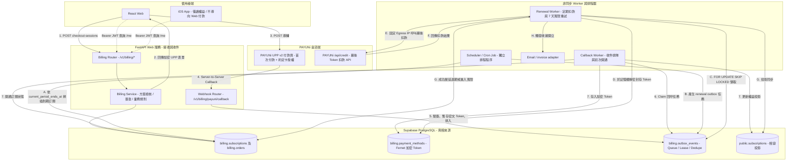
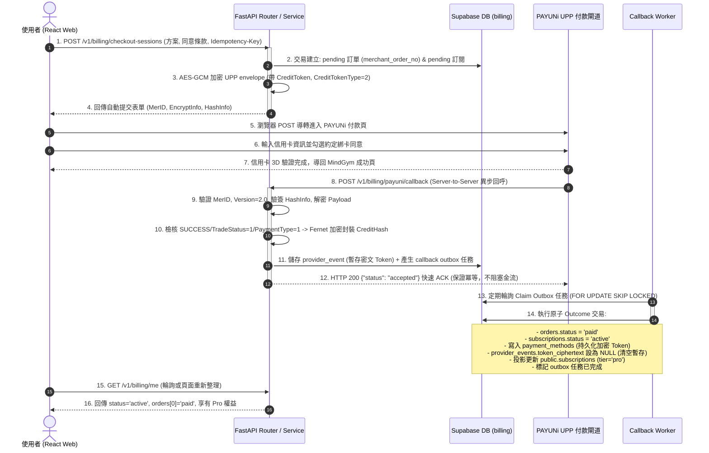
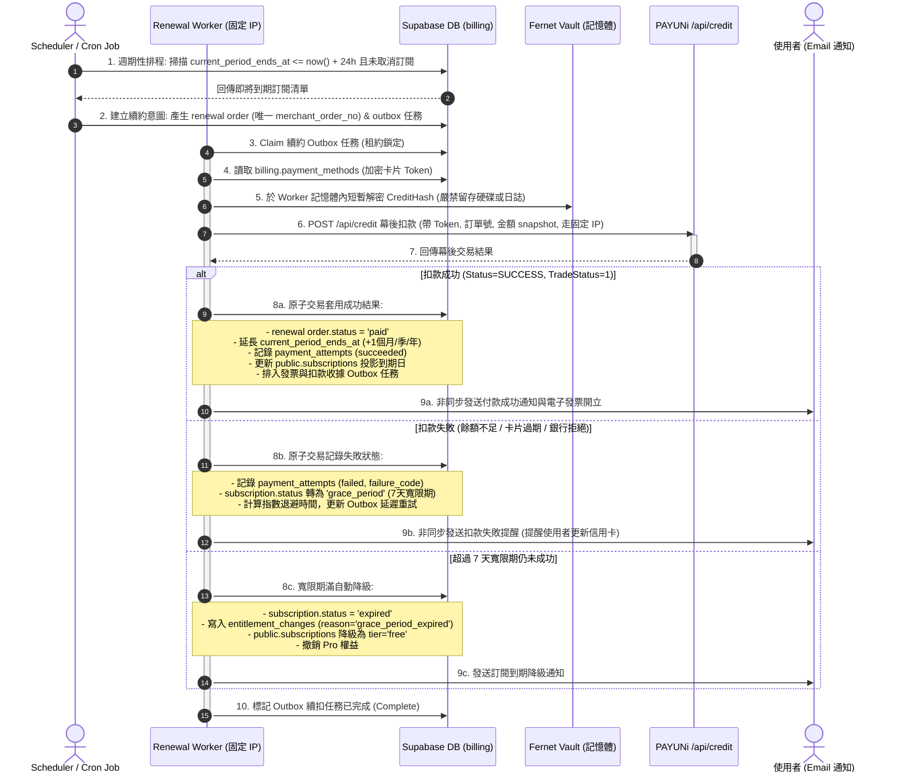
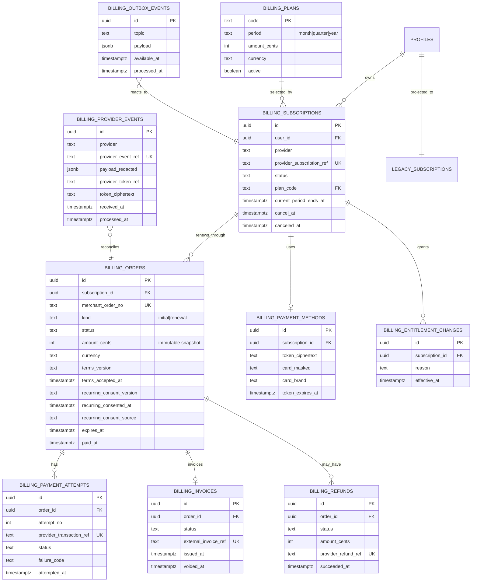
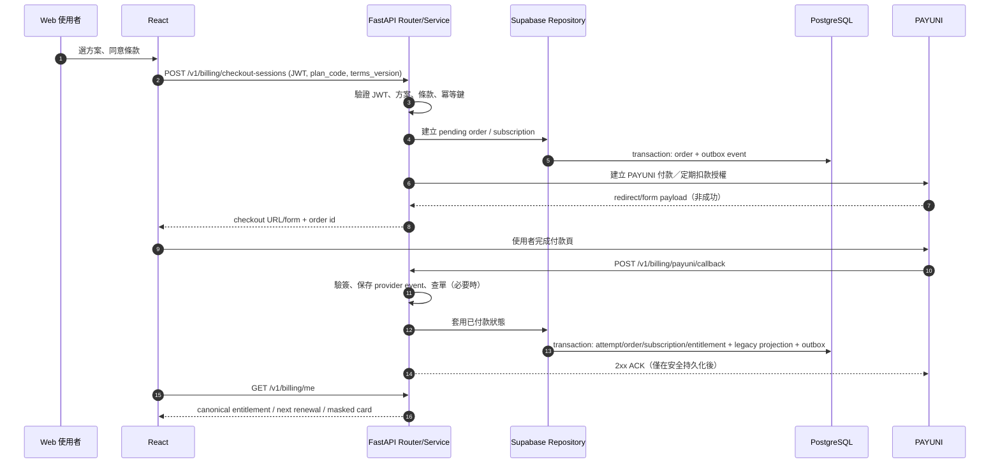
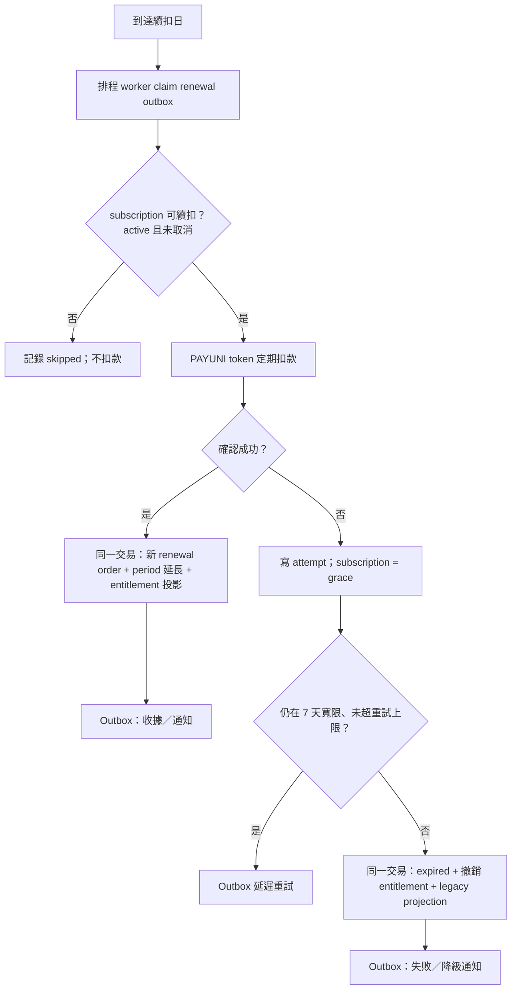
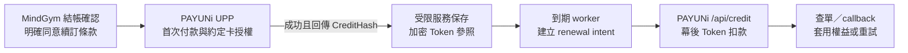
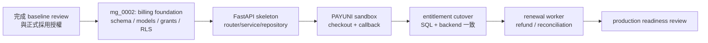

# PAYUNI 定期扣款訂閱：過渡期功能規格

> 狀態：**P2 本機驗收切片（P2.1 & P2.2）全數通過；P2.3 尚待真實 PAYUNi sandbox 外部驗收，不能對外收款**
> Owner：待指定
> 基線：`feat/alembic-orm-baseline` 的 `mg_0001_baseline`
> 最後更新：2026-09-28

## 1. 目的與邊界

本規格為 MindGym 建立第一條 FastAPI 垂直切片：網站前端透過 FastAPI 建立
PAYUNI 信用卡定期扣款訂閱；FastAPI 以 repository 層透過 Supabase/PostgREST
存取 PostgreSQL。這是過渡架構，**不是**現在就把資料庫改成 FastAPI 直連或
DDD。

首版提供月／季／年方案、付款、續扣、取消、付款失敗寬限與退款；Apple IAP
在本規格只保留權益整合邊界，**不實作 Apple 購買與續訂**。iOS App 不得導向
網站付款頁，並須依 App Store 規範另立 IAP 規格與流程。

電子發票必須有「何時建立、失敗如何重試、如何和訂單對帳」的可稽核紀錄；首版
可將開立動作交給既定的發票服務 adapter，但不可只在付款成功後 fire-and-forget
而不留狀態。

本規格不包含：Google Play Billing、分潤、發票實作細節、既有全功能免費策略的
即刻結束、將所有既有 FastAPI endpoint 重寫，或把 Alembic baseline 部署到正式
Supabase。

## 2. 已知現況與必須先校正的事實

| 現況 | 意義 | 此功能的處理 |
| --- | --- | --- |
| `mg_0001_baseline` 是本機限定、尚未正式接管的 snapshot | 不能拿它直接對正式庫 `upgrade` | 正式採用／版本登記必須先被明確授權；新功能只能新增 revision，絕不能改寫 `mg_0001`。 |
| `public.subscriptions` 每人一列 | 它是既有權益投影，沒有訂單、交易、token 或 webhook 審計 | 保留相容；新 `billing` 資料才是付款與訂閱真相來源。 |
| `pricing_config` 只有月／年與目前展示價格 | 價格可變，不可作為歷史訂單唯一證據 | 新訂單必須存不可變的方案／價格／稅額快照；季繳需另補方案。 |
| `is_pro()` 與 `backend/app.py::_subscription_tier()` 目前讓全部登入者為 Pro | 真金流上線後仍會全數解鎖 | 啟用收費牆前，兩者必須同一版改為讀取 canonical entitlement。 |
| 前端仍直接使用 Supabase | 付款資料若暴露給 browser，容易越權或竄改 | 金流寫入一律只走 FastAPI；browser 不取得 provider token、回呼資料或管理資料。 |

## 3. 目標架構（過渡期）

MindGym 採用 **「自主排程 + Token 幕後交易（A 方案）」**，而非依賴金流商託管自動排程。
整個過渡架構明確劃分為兩條閉環：(1) **首次結帳與約定卡授權**；(2) **MindGym 自主驅動的定期扣款與寬限循環**。



### 3.1 核心流程序列圖（Sequence Diagrams）

#### 3.1.1 流程一：首次結帳、約定卡授權與回呼開通時序

首次付款時，使用者在前端明確同意方案與續約條款，透過 FastAPI 建立 `pending` 訂單後，導向 PAYUNi UPP 頁面完成授權。PAYUNi 異步通知 FastAPI，再由 Worker 在後台原子開通權益並持久化加密 Token。



#### 3.1.2 流程二：MindGym 自主排程定期續扣時序

週期到期前，由 MindGym 獨立 Scheduler 建立續扣意圖，由具備固定 Egress IP 的 Renewal Worker 呼叫 PAYUNi `/api/credit` 幕後交易，並實施 7 天寬限與退避重試狀態機。



### 3.2 四層責任

| 層 | 實體位置 | 只負責 | 不負責 |
| --- | --- | --- | --- |
| **Router** | `backend/routers/billing.py` | JWT 驗證、Request/Response DTO、HTTP status、Callback 快速 ACK 簽收 | 付款狀態轉換、DB 交易、長耗時外呼 |
| **Service** | `backend/billing/service.py` | 建單、檢核方案與同意版本、驗簽、建構 UPP 表單、權益與業務規則 | DB 實體連線管理、SQL/PostgREST 拼裝 |
| **Repository** | `backend/billing/repository.py` | 透過 Supabase PostgREST/RPC 讀寫、Atomic Transaction RPC 呼叫 | PAYUNI 業務規則、回傳給前端的 DTO 決策 |
| **Worker / Scheduler** | `backend/billing/worker.py`<br>`scripts/run_billing_*.py` | 任務領取 (Lease)、退避重試 (Backoff)、Token 解密、呼叫 `/api/credit`、處理 Dead-letter | 處理使用者 HTTP Request、前端介面邏輯 |

`backend/app.py` 在此切片只保留 application factory、lifespan、middleware 與
`include_router()`；既有 endpoint 不在本次搬遷範圍。PAYUNI SDK／HTTP 呼叫統一封裝為
`backend/billing/payuni.py`，不得散落在 router、service 或 repository。

### 3.3 資料與權限原則

1. `billing` 是新 schema，Alembic 必須顯式納管它；不可只擴充 `public.subscriptions`
   就宣稱可稽核金流。
2. `billing` 不在瀏覽器 Supabase API 的 exposed schemas；只有 FastAPI 的 service
   role / 受限 runtime role 可存取。PostgREST 雖將 `billing` 納入 exposed schemas 以供
   FastAPI service-role 透過 REST/RPC 存取，但對 `anon` 與 `authenticated` 保持零授權 (Revoke)，
   client 完全無法直接讀寫。
3. 不儲存卡號、CVV 或完整卡片有效期限。只存 PAYUNI 回傳且營運必要的 token
   reference、遮罩卡號／卡別等最小資料；token 必須以伺服端專屬金鑰（如 Fernet Vault）
   加密後儲存於私有表，嚴禁明文記錄或外洩至前端與日誌。
4. PAYUNI 是「支付結果」的外部權威；本系統以驗簽、查單與冪等處理後的
   `billing` 記錄為內部稽核權威；`public.subscriptions` 只是相容投影。
5. 定期扣款有兩個不可互相取代的門檻：(a) MindGym 結帳確認頁記錄的方案、
   金額、週期、取消規則與條款同意；(b) 使用者在 PAYUNi 付款頁完成的約定卡授權。
   前者不是卡片授權，後者也不能取代我方的條款同意紀錄。

### 3.4 定期扣款運作核心原則（MindGym 自主排程）

1. **MindGym 為扣款日曆權威**：
   本系統不使用 PAYUNi 的定時自動扣款產品。訂閱續約日期由 `billing.subscriptions.current_period_ends_at`
   決定，由 MindGym 的獨立 Scheduler 排程主動發動續約，掌握完整的計費生命週期。
2. **扣款意圖先行與防重複扣款（Idempotent Renewal Intent）**：
   每次發起續扣前，必須先在 `billing.orders` 建立一筆唯一的 renewal order (`kind='renewal'`) 與
   Outbox 任務。Worker 執行時必定以該筆 order 的 `merchant_order_no` 呼叫 PAYUNi `/api/credit`，
   確保網路逾時或重試時絕不發生二次扣款。
3. **安全沙盒與網路邊界隔離**：
   - 卡片 Token (`CreditHash`) 僅在 Worker 執行扣款的瞬間於記憶體內短暫解密，不可留存明文於暫存檔。
   - 正式環境呼叫 PAYUNi `/api/credit` 的 Worker 必須部署在具備固定 Egress IP（如 AWS NAT Gateway / Elastic IP）
     的受限專屬環境，並將 IP 加入 PAYUNi 白名單。Web API 容器不得直接持有幕後扣款權限。
4. **失敗寬限與漸進降級狀態機**：
   續扣失敗時不立即撤銷使用者權益，訂閱狀態轉入 `grace_period`（7 天寬限期），由 Outbox 實施指數退避重試；
   若在 7 天後且達重試上限仍失敗，才於同一原子交易將訂閱轉為 `expired`，並撤銷 canonical entitlement 與
   `public.subscriptions` 投影。

## 4. 建議資料模型

下列是 `mg_0002_billing_foundation` 的設計目標，欄位名稱可在實作前與 PAYUNI
實際 contract 對齊，但狀態、唯一鍵與不可變快照不可省略。



### 4.1 必要約束與索引

- `merchant_order_no` 全域唯一且由伺服器生成；取消／逾時後重新付款必定建新單，
  不重用 PAYUNI 商店訂單編號。
- 一個 user 同時最多一筆 `pending` 初始訂單（partial unique index），但先查單後
  才能決定續用、作廢或重建。
- `provider_event_ref`、`provider_transaction_ref`、退款 provider reference 均唯一，
  保證 webhook、輪詢與人工重送不會重複開通／退款。
- `amount_cents`、`currency`、方案名稱快照寫入訂單後不可更新；改價只影響新訂單。
- 每張初始訂單必須帶 `terms_version`、`terms_accepted_at`、
  `recurring_consent_version`、`recurring_consented_at` 與不可由 browser 偽造的同意來源；
  不能以「目前頁面有顯示條款」替代同意紀錄。
- callback 若取得 `CreditHash`，只能以服務端 vault 加密後暫存於 private provider event；
  outcome transaction 成功時原子搬入 `payment_methods.token_ciphertext`，並清除 event 暫存值。
  `provider_token_ref` 是不可逆摘要參照，不能是明文 `CreditHash`。
- `billing.invoices` 的狀態與外部發票號需可與 order 對應；發票建立／作廢失敗須透過
  outbox 重試或進人工處理，不能阻塞已確認的付款 callback。
- 所有時間使用 `timestamptz`；狀態轉換需由 service + 單一 transaction/RPC 執行，
  不可由 client PATCH。

### 4.2 既有表的處置

| 既有物件 | 決策 |
| --- | --- |
| `public.pricing_config` | 過渡期可當展示設定來源；付款建立時改由 service 讀取受控 `billing.plans`（或同步後的唯讀來源）並 snapshot。 |
| `public.subscriptions` | 維持前端與既有 SQL/RPC 相容。每次 entitlement change 在**同一個 DB transaction** upsert 此投影，不能手動雙寫。 |
| `paywall_intents` | 保留產品分析；不得當成付款成功或授權扣款的證據。 |
| `is_pro()`／`get_my_entitlements()`／`_subscription_tier()` | 在收費牆正式開啟的同一 release 改為讀 canonical entitlement；三者以整合測試鎖住一致性。 |

## 5. 主要流程

### 5.1 首次訂閱與回呼



**關鍵規則**：前端導回成功頁、PAYUNI browser redirect 與 callback 都不是權益
開通依據。只有伺服器驗簽後已持久化的 provider event，加上需要時的 PAYUNI
查單結果，才能把狀態改為 `active`。

### 5.2 自動續扣、失敗與寬限



- 重試次數、間隔、PAYUNI token 的有效／失效語義必須以 PAYUNI 核准的 merchant
  contract 定義，寫入設定而非散落在程式碼。
- worker 以 `FOR UPDATE SKIP LOCKED`（或等效 Supabase RPC）claim outbox；每件工作
  要有 lease、attempt count、backoff、dead-letter／人工處理狀態。
- 不可把付款 HTTP 呼叫包在長時間資料庫 transaction；先持久化意圖，再呼叫 provider，
  結果以 idempotent transaction 套用。

### 5.2.1 A 方案：CreditHash capability 與啟用關卡

採用 A 方案時，PAYUNi 的 UPP 首次付款會在使用者完成**約定卡授權**後回傳
`CreditHash`；MindGym 的 worker 才能在後續週期，以 Token 幕後交易 API 執行續扣。
這不是 PAYUNi 自動排程產品：扣款日、重試、寬限、取消與對帳仍由 MindGym 管理。



實作時必須分開三個開關，且預設皆為關閉：

| 開關／能力 | 允許的行為 | 開啟前置條件 |
| --- | --- | --- |
| `initial_card_agreement` | 在加密 UPP envelope 加入 `CreditToken` 與約定卡欄位 | PAYUNi 已核准該商店的 Token contract；MindGym 已取得使用者明確同意 |
| `backend_token_charge` | 呼叫 `/api/credit` 幕後扣款 | 前項完成、Token 安全保存、PAYUNi allowlist 已核准來源 IP、worker/runbook 已就緒 |
| `token_query`／`token_cancel` | 查詢／取消約定卡 | PAYUNi 核准相應 API，取消業務規則已驗收 |

API key、HashKey／HashIV 本身**不**代表上述能力已核准。程式必須同時要求「PAYUNi
書面核准」的設定旗標與個別 operation 的 runtime feature flag；在任一旗標未開啟時，
拒絕操作，不可靜默退回一般付款後宣稱已約定續扣。

MindGym 不需要在同一 PAYUNi 會員帳號的多個商店間共用卡片 Token，因此首次 UPP 請求
固定帶 `CreditTokenType=2`（商店限定）；`UseTokenType=1` 仍代表使用者可在 PAYUNi
付款頁取消約定，不是強制綁卡。

### 5.2.2 UPP v2 callback：可驗證的事實與安全映射

PAYUNi 的 [UPP v2 公開文件](https://docs.payuni.com.tw/web/#/7/34) 已定義通知封包，
所以可以對 MindGym 的 callback 邊界做**加密封包模擬**；它不能替代 PAYUNi sandbox
實際授權或證明 `CreditHash` 可用。

| 層次 | 文件定義／MindGym 驗證 |
| --- | --- |
| 外層 Form POST | `MerID`、`Version=2.0`、`EncryptInfo`、`HashInfo`。MindGym 先檢查商店代號、版本與 Hash。 |
| 解密後共通欄位 | `Status`、`Message`、`MerTradeNo`、`TradeNo`、`TradeAmt`、`TradeStatus`、`PaymentType`、`Gateway`。只保存白名單的非敏感欄位。 |
| 可安全視為首次約定卡成功 | `Status=SUCCESS`、`TradeStatus=1`、`PaymentType=1`，且有已核准 capability 時才接受 `CreditHash`；Token 只進 server-side Fernet vault。 |
| 不能自行猜測的結果 | `UNKNOWN`、`UNAPPROVED` 及 PAYUNi 錯誤碼。它們先留在 outbox，待 P4 的交易查詢 adapter 依商戶 contract 確認，不能直接設成 paid 或 failed。 |

`scripts/simulate_payuni_callback.py` 是本機開發工具：以 HashKey／HashIV 組出上述
**假** callback 並 POST 到本機 FastAPI。成功情境的 `CreditHash` 是不可用的固定假值；
它只驗證驗簽、redaction、vault、outbox 與冪等性，不呼叫 PAYUNi、也不會產生真交易。

```bash
# 先由本機 secret environment 注入 PAYUNI_*，不要把 key 寫進指令或 git。
python scripts/simulate_payuni_callback.py \
  --merchant-order-no '既有的本機 pending order 編號' \
  --amount-twd 100 \
  --outcome success
```

預設只允許 `127.0.0.1` callback；若是核准的 sandbox tunnel／staging endpoint，才可
明確加上 `--allow-non-loopback`。它仍不是 PAYUNi 的真實 callback 驗收。

### 5.3 使用者取消、退款與對帳

| 情境 | 系統行為 | 權益何時變更 |
| --- | --- | --- |
| 使用者取消自動續扣 | 向 PAYUNI 取消 token／定期扣款，保存結果；`cancel_at = current_period_ends_at` | 已付款當期保留到期日，不立即降級。 |
| 7 日一般退款 | 管理端發起，先呼叫 PAYUNI；只有 provider 成功才記成功退款與取消續扣 | 成功退款 transaction 內立即撤銷 entitlement。 |
| 重複／錯誤扣款 | 依客服審核與 PAYUNI 結果處理；不可只靠管理 UI 改 DB | 依退款成功結果執行，保留完整 audit。 |
| 24 小時未完成付款 | worker 先查 PAYUNI 再將訂單標逾時；晚到成功改為 paid 並標記 anomaly | 查單確認前不將 pending 視為失敗；確認 paid 才開通。 |
| 每日對帳 | 匯入／查詢 provider 結果，比對 orders、attempts、refunds | 不自動覆寫衝突；建立 anomaly 與通知，供人工處理。 |

付款成功後發票 adapter 的工作也由 outbox 觸發。invoice 失敗是需要告警與重試的帳務
異常，但不應倒回已經由 PAYUNI 確認的付款／訂閱權益；除非甲方另定義法遵上的
阻斷規則。

## 6. API 契約（第一版）

所有 `/v1/billing/*` 的 client API 經 FastAPI。使用者 ID 永遠從 JWT 取得，request
body 不得帶 `user_id`。`Idempotency-Key` 為建立 checkout、取消與退款的必要 header。

| 方法與路徑 | 呼叫者 | 目的 | 回傳要點 |
| --- | --- | --- | --- |
| `GET /v1/billing/plans` | public web | 可販售方案 | code、展示名稱、價格、幣別、period、條款版本 |
| `POST /v1/billing/checkout-sessions` | 已登入 Web | 建立初始訂單與 PAYUNI 導轉資料 | order id、status、provider redirect/form、expires_at；啟用約定卡時另需伺服器驗證的 recurring consent |
| `GET /v1/billing/orders/{id}` | 本人 | 輪詢付款狀態 | order status、paid_at、可否 resume |
| `POST /v1/billing/orders/{id}/resume` | 本人 | 為未過期的 pending／processing 舊單重建 PAYUNI 導轉資料，沿用原 merchant order no；不新建訂單 | checkout session |
| `POST /v1/billing/subscription/cancel` | 本人 | 關閉未來自動續扣 | status、current_period_ends_at、cancel_at |
| `GET /v1/billing/me` | 本人／iOS | 訂閱與付款歷史的安全視圖 | subscription status、期間、next charge、orders；P3 前不是 canonical entitlement |
| `POST /v1/billing/payuni/callback` | PAYUNI | server-to-server 付款通知 | 僅 ACK；不回傳帳務細節 |
| `POST /v1/admin/billing/refunds` | admin | 發起退款 | refund id、processing／succeeded／failed |
| `GET /v1/admin/billing/reconciliation` | finance admin | 對帳清單、異常與匯出 | read-only paginated result |

`POST /v1/billing/checkout-sessions` 的 body 除 `plan_code`、`terms_version` 外，必須有
`recurring_consent: true` 與 `recurring_consent_version`。`false` 或缺少欄位一律拒絕；
user id 與 `recurring_consent_source=web` 由後端決定，不接受 browser 指定。

PAYUNI 公開文件可用來實作 UPP、Token API 的**協定 adapter**；但 callback 的實際結果
映射、IP allowlist、timeout、商戶可用的操作組合與上線值，仍須以 PAYUNi 對該商店的
核准結果為準。未核准時不得啟用 Token 保存、結果套用或任何真實扣款。

## 7. Alembic 與 Supabase 的落地順序



1. 將 baseline 正式採用視為獨立 change；它目前會阻止 non-loopback URL 與 `stamp`，
   這些保護不可為了付款而移除。
2. 新增 `mg_0002_billing_foundation`，建立 `billing` schema、表、索引、最小權限、
   RLS、資料 migration（如需要）與 `billing.outbox_events`；`mg_0003_billing_workflow`
   放置 checkout、callback/outbox 與受控 read RPC；不得修改
   baseline assets 或 `mg_0001_baseline.py`。
3. 擴充 `backend/database/models.py` 與 `backend/database/scope.py`，讓 Alembic 明確
   對 `billing` schema 有 ownership；同時新增 head-level catalog verifier，不能改寫
   `verify_baseline.py` 的 0001 期望。
4. 先完成 sandbox 的建單、callback 冪等、權益投影整合測試，再啟用真實 paywall。
5. 待 PAYUNI 定期扣款 contract、固定 egress IP、callback 公網 HTTPS、秘密管理、
   發票責任與營運值班均已備妥，才實作／啟用續扣 worker。

## 8. 驗收條件

- [x] 新 migration 可在新的本機 Supabase 從 `mg_0001` 升到 head，重跑無副作用。
- [ ] 無 JWT、他人 JWT 與 browser Supabase client 都無法讀寫付款 token、callback、
      訂單或退款資料。
- [ ] 同一 `Idempotency-Key` 反覆建立 checkout 只產生一張有效訂單；同一 PAYUNI
      callback 重送不會產生兩次付款、兩段權益或兩封通知。
- [ ] callback 偽造／驗簽失敗／未知訂單均不開通權益，且可被安全稽核。
- [ ] 付款成功、失敗、取消、退款、24 小時逾時與晚到成功都有狀態轉換測試。
- [ ] 條款版本與同意時間可由訂單稽核；發票建立／作廢的成功、失敗與重試狀態可對帳。
- [ ] `billing` canonical entitlement、`public.subscriptions`、`is_pro()`、
      `get_my_entitlements()` 與 FastAPI `_subscription_tier()` 在測試矩陣一致。
- [ ] 續扣 worker 可安全重跑，失敗遵守 7 天寬限與上限，沒有重複扣款。
- [ ] 每日對帳能列出 provider-only、MindGym-only、金額／狀態不符事件；不可靜默修正。
- [ ] 日誌與 error tracker 不含 token、完整卡號、CVV、完整 callback 敏感 payload 或 secret。

## 9. 動工前仍需甲方／商務確認

1. 月／季／年每個方案的售價、幣別、稅／發票開立主體與生效日。
2. PAYUNI 商戶號、sandbox、信用卡 Token／幕後交易是否核准、來源 IP allowlist、
   callback 結果語義，以及查單／取消／退款的商戶 contract。
3. Render（或正式 backend）固定對外 IP、callback HTTPS URL、PAYUNI allowlist 的可行性。
4. 退款政策的精確文字、人工退款的角色與 SLA，以及 7 天起算點。
5. 已有使用者／創始會員如何轉換；收費牆何時從「全登入者 Pro」切回真實權益。
6. iOS 僅讀權益的過渡 UX，以及 Apple IAP 上線後 Web／Apple 同帳號權益合併規則。

## 10. 實作追蹤（規格完成後才開始）

| 階段 | 交付物 | 開始門檻 |
| --- | --- | --- |
| P0 | baseline 正式採用方案、PAYUNI contract 與商務決策 | §9 已確認 |
| P1 | `mg_0002` foundation、`mg_0003` workflow、ORM metadata、RLS/RPC、資料庫整合測試 | P0 完成 |
| P2 | router/service/repository 骨架與 sandbox initial checkout/callback | P1 完成 |
| P3 | entitlement cutover、取消、付款歷史、管理退款 | P2 驗收通過 |
| P4 | token 續扣 worker、7 天寬限、對帳、監控與 runbook | PAYUNI 與營運前置到位 |
| P5 | production readiness / rollout | P0–P4 全部驗收 |

### 10.1 目前實作狀態（最後更新：2026-09-28）

#### 階段進度總覽

| 階段 | 狀態 | 已完成 | 完成前仍需 |
| --- | --- | --- | --- |
| P0：採用與商務前置 | 阻擋中 | baseline 的本機基準、需求與風險已盤點 | 正式採用授權、PAYUNi recurring／查單 contract、方案／退款與營運決策 |
| P1：資料基礎 | 本機驗收通過，尚未正式採用 | `mg_0002_billing_foundation`、ORM scope、RLS／grants、outbox；全新本機 Supabase migration／verifier／integration suite | 正式採用授權與正式環境接管流程 |
| P2：初始付款流程 | P2.1 & P2.2 本機驗收通過；P2.3 sandbox 外部驗收阻擋中 | checkout 明確續扣同意、約定卡 UPP v2 adapter、Fernet vault、驗簽 receipt／callback outbox、成功結果的金額／交易型別檢查、原子 Token 保存與 outcome transaction、受控 one-shot worker、owner read APIs、topic-specific claim／defer／dead-letter；單元、router、callback simulator 與 migration static tests；隔離 Local Supabase DB migration suite（24 項通過）；FastAPI 本機端到端閉環測試（8 項全過，含 plans、checkout、order、signed callback、worker、DB outcome 斷言、/v1/billing/me 與冪等重送） | PAYUNi Token／IP 核准、真實 sandbox E2E、正式環境部署 scheduler 與告警 |
| P3：權益與帳務操作 | 本機驗收通過 | P3.1 取消自動續扣、P3.2 Canonical entitlement cutover、P3.3 管理員退款、P3.4 整合測試與 E2E 矩陣（`backend/tests/test_p3_matrix.py` 54/54 全過，`scripts/verify_p3_e2e.py` 6/6 全過） | PAYUNi Sandbox / Production 外部驗收 |
| P4：自動續扣營運 | 未開始 | outbox schema、callback job、service-role health／dead-letter read model 已備妥 | token contract、renewal worker、7 天寬限、對帳、告警／runbook |
| P5：上線 | 未開始 | — | P0～P4 驗收、資安與營運 readiness review |

**目前位置：P2 與 P3 本機驗收切片全數通過；P4 待進行。**
只有 UPP v2 文件明確定義的「信用卡成功」組合會被 sandbox resolver 映射為
`succeeded`；其他 callback 會安全 defer，等待 P4 的交易查詢 adapter 與商戶 contract。

#### 已完成交付 checklist

- [x] `mg_0002_billing_foundation`：billing ledger、RLS／grants、outbox 基礎。
- [x] `mg_0003_billing_workflow`：checkout、callback receipt/outbox、owner read RPC。
- [x] FastAPI router／service／repository：plans、checkout、order、resume、overview、callback。
- [x] callback queue：topic claim、lease、retry 上限、dead-letter、service-role monitor 與唯讀 CLI。
- [x] provider-neutral outcome transaction：付款 attempt、order、subscription、entitlement、legacy projection 一起更新。
- [x] unit／static／repository transport tests，以及本機 Supabase callback receipt／outbox 重送、payment outcome 成功／失敗、未驗簽／未知訂單拒絕 integration cases。
- [x] A1 約定卡 UPP adapter：明確 consent 與 PAYUNi merchant capability 的雙重開關；未核准時不得生成約定卡欄位。已以單元測試驗證 capability 的雙旗標、加密 envelope 與 Token 不外洩（2026-09-27）。
- [x] P2 完整程式範圍：續扣同意寫入 order、callback 的 `CreditHash` server-side Fernet 加密、成功 outcome 原子寫入 payment method 並清除 callback 暫存、金額一致性驗證、受控 one-shot worker 與本機測試（2026-09-27）。
- [x] UPP v2 的外層版本／商店代號與成功 callback 組合防護；本機 signed callback simulator（2026-09-28）。
- [x] P2.1 以目前 `mg_0003_billing_workflow` 在隔離 Local Supabase 跑通完整 migration integration suite（15 項 integration + 9 項 static tests 全數通過；修正 `payment_methods` upsert constraint 名稱衝突）。
- [x] P2.2 本機端到端閉環測試（8/8 全過：plans -> checkout -> orders query -> signed callback -> callback worker -> DB assertion [order=paid, sub=active, token sealed & decryptable in payment_methods, provider_events cleansed] -> /v1/billing/me -> 冪等重送；由 `scripts/verify_p2_e2e.py` 自動化）。
- [x] P3.1 取消自動續扣：`mg_0004_billing_lifecycle` RPC (`cancel_subscription_for_user`)、PAYUNi `/api/credit_bind/cancel` token cancel adapter、`POST /v1/billing/subscription/cancel` endpoint 與完整單元/repository/router 測試（2026-09-28）。
- [x] P3.2 Canonical Entitlement Cutover：`mg_0005_entitlement_cutover` migration (`is_pro`, `get_my_entitlements`)、`backend/app.py` `_subscription_tier` 讀取權益與 Cutover 測試（2026-09-28）。
- [x] P3.3 管理員退款機制：`mg_0006_billing_refunds` migration (`process_admin_refund` RPC, 原子撤銷權益與 outbox 佇列)、`POST /v1/admin/billing/refunds` API 端點與完整單元/repository/router 測試（2026-09-28）。
- [x] P3.4 端到端整合與狀態轉換測試矩陣：新增 `backend/tests/test_p3_matrix.py` (54/54 全過) 與 `scripts/verify_p3_e2e.py` 端到端驗證腳本 (6/6 步驟全過：免費會員 -> 訂購成功 -> 使用者取消 -> 到期前保留權益 -> 管理員退款 -> 原子撤銷權益與即時降級) (2026-09-28)。
- [ ] P2.3 PAYUNi 核准後的真實 sandbox E2E：首次授權、成功／失敗 callback、Token 保存、重送、查單與取消。
- [ ] worker 的正式部署／排程、告警與 dead-letter 人工處理 runbook。
- [ ] P4 自動續扣、寬限與對帳。


> §8 是「上線驗收」而非程式工作清單；其中條件尚未以實際 Supabase／PAYUNi 流程驗收，
> 因此維持未勾。上列 checklist 才表示目前已完成的程式交付。

#### 實作台帳（新 agent／新對話從這裡續接）

| Revision / commit | 已交付 | 尚未代表 |
| --- | --- | --- |
| `mg_0002_billing_foundation` / （本次收斂提交） | 10 張 billing ledger 表、RLS、service-role grants、outbox claim RPC | 正式 Supabase baseline 接管或任何 PAYUNI 交易 |
| `mg_0003_billing_workflow` / `ab1cbe2` + 後續 commits | checkout intent、已驗簽 callback receipt + outbox、本人訂單／resume／overview RPC、可信 outcome transaction、claim／complete／retry worker RPC | PAYUNi generic callback 已被映射為可信 outcome；worker 已部署排程；正式付款結果已驗收 |
| `mg_0004_billing_lifecycle` / `18ce522` | P3.1 用戶取消訂閱 RPC (`cancel_subscription_for_user`)、PAYUNi token cancel adapter 與 `POST /v1/billing/subscription/cancel` API | 正式環境已連線 PAYUNi token 取消 API |
| `mg_0005_entitlement_cutover` / `8d87c9e` | P3.2 Canonical Entitlement Cutover (`public.is_pro`, `public.get_my_entitlements` 與 FastApi `_subscription_tier`) | 影響非 billing 表歷史資料 |
| `mg_0006_billing_refunds` / `7697b01` | P3.3 管理員退款 RPC (`process_admin_refund`)、原子撤銷權益與 `POST /v1/admin/billing/refunds` API | 正式環境已連線 PAYUNi 全額/部分退款 API |
| P3.4 E2E Matrix Verification / （本次提交） | Billing Overview (`tier`, `is_pro`) 擴充、P3 完整測試矩陣 (`test_p3_matrix.py`) 與 E2E 自動驗證腳本 (`verify_p3_e2e.py`) | 線上正式環境黑箱 E2E 測試 |

本次已驗證：billing service unit tests、migration static tests、Alembic offline SQL
內容、Python compile、FastAPI OpenAPI route 與 `git diff --check`。2026-09-26 已在新建、
隔離的本機 Supabase PostgreSQL 17.6 執行 `alembic upgrade head`、`alembic check`、baseline／
billing head verifier 與 15 項 migration integration tests（另有 9 項 static tests），全數通過；
其中 callback receipt／outbox 與 payment outcome 的重送、成功、失敗不授權、未驗簽／未知訂單拒絕情境皆已執行。
這仍不代表正式 Supabase 採用、
PAYUNi sandbox 交易或 production 驗收。

另有 repository HTTP contract tests，以 mock transport 固定驗證 Supabase/PostgREST 的
service-role schema headers、callback topic claim、retry 回傳值與使用者 JWT 驗證邊界；
這些測試不連線 Supabase，不能取代本機 PostgreSQL integration tests。

- `mg_0002_billing_foundation` 已建立 provider-neutral 的 `billing` schema、10 張表、
  私有權限邊界、RLS 與可 lease／重試的 outbox claim RPC。
- `mg_0003_billing_workflow` 已提供 service-role 專用的交易式 checkout intent RPC、
  callback receipt/outbox 與 owner-scoped read RPC；同一 subscription／`Idempotency-Key`
  只會得到同一筆 order。
- SQLAlchemy metadata 與 Alembic ownership 已納入 `billing`；0001 baseline 資產未修改。
- 已加入 head verifier、靜態測試與本機 Supabase 整合測試案例；FastAPI 的
  router／service／repository／provider port 也已建立並掛入 `app.py`。
- 已提供 owner-scoped 的訂單狀態、resume 與 billing overview read model：
  `GET /v1/billing/orders/{id}`、`POST /v1/billing/orders/{id}/resume`、`GET /v1/billing/me`。
  resume 只會重建未過期 `pending`／`processing` 訂單的導轉資料，沿用既有 order 與
  `merchant_order_no`；overview 在 P3 entitlement cutover 前只是 billing read model。
- P2 已封裝首次約定卡的 UPP v2 欄位與**文件明確的信用卡成功 callback** 結果套用；checkout
  endpoint 在 provider contract 未啟用時固定回 503，不能因路由存在而視為可收款。
- 已依 PAYUNi 公開 UPP v2 文件實作加密 envelope／HashInfo 與導轉 form，
  但僅在 `PAYUNI_GENERIC_UPP_SANDBOX_ENABLED=1` 且下列環境變數齊全時啟用：
  `PAYUNI_MERCHANT_ID`、`PAYUNI_HASH_KEY`、`PAYUNI_HASH_IV`、`PAYUNI_RETURN_URL`。
  未取得 PAYUNi 核准的 Token／幕後授權 contract 前不得啟用約定卡欄位或用於正式收款。
- callback 一律先驗證 UPP v2 envelope 並以冪等事件收據保存；只保存訂單號、交易號、
  狀態、交易型別與金額等白名單欄位。只有「商戶能力已開啟」且「文件明確的信用卡成功」
  組合，才將 `CreditHash` 以 server-side vault 密文暫存；其餘情況絕不保存。receipt 寫入
  同時會產生 `billing.provider_callback.received` outbox event；同一 provider event 只會有一筆
  job，讓 worker 可安全重試處理。
- P2 已將 UPP 約定卡欄位封裝在 provider adapter，並以
  `PAYUNI_TOKEN_CONTRACT_APPROVED=1` 加上個別 sandbox capability flag 雙重保護。
  checkout API 需帶 recurring consent version；後端只使用 JWT 導出的 user id 建立
  merchant member reference。驗簽 callback 的 `CreditHash` 只會用
  `BILLING_TOKEN_ENCRYPTION_KEY` 加密後傳入 private RPC；成功 outcome 的 transaction
  才會寫入 `payment_methods`，並清除 event 的暫存 ciphertext。任何 browser response、
  payload redaction、log 與 outbox 都不含 Token。

#### P2 驗收與下一關卡的阻擋條件

P2 的 worker 已能消費文件明確的首次約定卡成功事件，同一交易內建立／更新
`payment_attempts`、更新 order／subscription、寫入 `entitlement_changes`、legacy projection
與 outbox。失敗、未知與重送的最終語義仍須 PAYUNi 的交易查詢 contract；在它核准前，
不得把 generic callback 的錯誤碼猜成最終失敗。

`billing.apply_initial_payment_outcome(...)` 已建立上述單一 transaction 的資料庫邊界：
它只接受 `succeeded`／`failed` 與已驗簽、未處理、能對應訂單的 provider event；成功時才
建立 payment attempt、啟用 subscription、寫入 entitlement／legacy projection 與 outbox。
**現階段沒有 adapter 或 route 會呼叫它。** 只有在 PAYUNi contract 明確定義 outcome 映射後，
worker 才能取得 service-role 權限呼叫；generic UPP 的 callback 仍只會產生 receipt/outbox。

`backend/billing/worker.py` 的 `BillingCallbackWorker` 只會 claim callback topic，避免占用其他
billing worker 的 lease；它讀取已驗簽 event，並在 resolver 尚未設定時以 15 分鐘延遲安全
reschedule，不會呼叫 outcome transaction。缺少 provider event id 或 resolver 回傳不支援 outcome
的 job 會進 dead-letter，供人工處理，不會無限重試。

每個 callback job 的 retry 上限由 worker 建構時注入（目前預設 20，允許 1～100）；
`reschedule_outbox_event` 會以 DB 內已 claim 的 `attempt_count` 判斷，達上限時直接轉為
dead-letter，而不是再次排程。部署 worker 時必須將此值設定為營運設定並建立 dead-letter 告警。

`BillingOutboxMonitor` 與其 service-role RPC 可讀取 callback topic 的各狀態數量、最早待處理
時間及 dead-letter 清單，供 deployment health check／告警整合使用；不提供 browser client
或一般使用者 API，也尚未建立管理後台 UI。

本機／受控 runner 可使用唯讀 CLI 產出 JSON report：

```bash
BILLING_OPERATIONS_ENABLED=1 \
SUPABASE_URL='https://your-project.supabase.co' \
BILLING_SERVICE_ROLE_KEY='由秘密管理系統注入' \
python scripts/billing_outbox_report.py
```

CLI 不接受 browser key，且未明確設定 `BILLING_OPERATIONS_ENABLED=1` 會拒絕執行；輸出只含
queue health 與 dead-letter 的安全欄位，不能用來建立 checkout、處理 callback 或變更帳務。
當未來的 PAYUNi resolver 回傳已核准的 `succeeded`／`failed` outcome 時，worker 才會先套用
transaction、再 complete outbox job。**此 worker 尚未掛入 FastAPI lifespan、Cron 或任何部署排程。**

P2 提供受控的一次性執行入口，供核准後的 scheduler 呼叫，不會隨 FastAPI 啟動：

```bash
BILLING_OPERATIONS_ENABLED=1 \
SUPABASE_URL='https://your-project.supabase.co' \
BILLING_SERVICE_ROLE_KEY='由秘密管理系統注入' \
PAYUNI_TOKEN_CONTRACT_APPROVED=1 \
PAYUNI_INITIAL_PAYMENT_OUTCOME_SANDBOX_ENABLED=1 \
python scripts/run_billing_callback_worker.py --limit 20
```

首次約定卡 callback 還需要獨立的 `PAYUNI_INITIAL_CARD_AGREEMENT_SANDBOX_ENABLED=1`、
`PAYUNI_GENERIC_UPP_SANDBOX_ENABLED=1` 與 `BILLING_TOKEN_ENCRYPTION_KEY`；這些只可由
secret manager 注入。正式 scheduler、固定 egress IP、告警與 dead-letter runbook 仍屬外部
驗收門檻，不能因這個 CLI 存在而視為已部署。

此文件的 10.1 是後續 agent／新對話的進度來源；每一個 commit 應同步更新此段、列出
migration revision、已驗證項目與下一個阻擋條件。

---

### 參考

- [資料庫 baseline 與採用邊界](../../database/README.md)
- [既有訂閱／權益 SQL（歷史參考）](../../../supabase/subscriptions.sql)
- [結案後訂閱產品計畫（產品脈絡，非工程契約）](../../plans/aftercare_subscription_plan.md)
