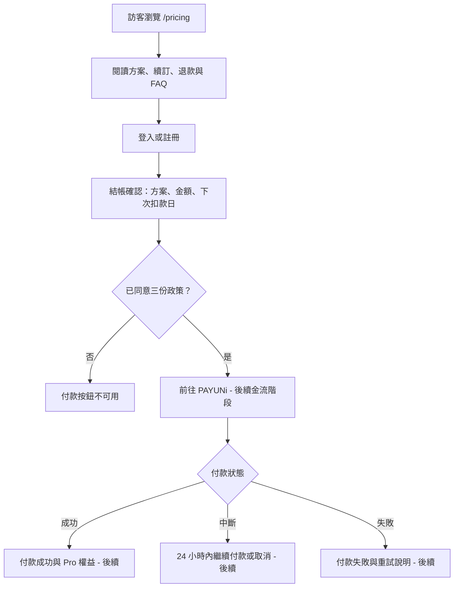

# PAYUNI 官網與付款資訊呈現：功能規格

> 狀態：Draft  
> 最後更新：2026-09-26  
> 來源：[PAYUNi 申請用｜官網與付款流程內容初稿](../../../../PAYUNi申請_官網內容初稿.docx.pdf)  
> 相依規格：[PAYUNI 定期扣款訂閱](payuni-recurring-subscription.md)

## 1. 目的與本次邊界

本規格將 PAYUNi 審核與使用者需要理解的服務、方案、取消與退款資訊，整理成可在
Web 與 iOS 正確呈現的前端交付項目。目標是讓未登入的 PAYUNi 審核人員可完整閱讀
公開資訊，也讓已登入使用者在付款前了解方案與自動續訂規則。

本次**只做資訊頁與付款前的 UI／文案規格**，不做下列事項：

- 不串接 PAYUNi 建單、回呼、Token 或定期扣款。
- 不實作付款成功後的 entitlement／API 存取限制。
- 不實作退款、對帳、發票、付款紀錄或訂閱管理的後端功能。
- 不以此文件確認 PAYUNi 或 Apple 的商務／法務審核結果。

上述金流功能應依 `payuni-recurring-subscription.md` 的後續階段處理；API 限制則要等
付款生命週期與唯一權益資料來源定案後另立規格。

## 2. 產品呈現原則與平台邊界

| 平台 | 可見內容 | 不應出現的內容 |
| --- | --- | --- |
| Web（未登入亦可） | `/pricing`、退款、條款、隱私、客服與商家資訊 | 無 |
| Web（登入後） | 上述內容；未來可進入結帳確認與訂閱管理 | 未完成的真實 PAYUNi 付款入口不得假裝可用 |
| iOS App | 服務條款、隱私、客服、既有權益與訂閱狀態 | PAYUNi Web 結帳 CTA、外連 `/pricing` 的導購入口 |

目前 iOS 是 Capacitor WebView，技術上能載入 Web 路由；本規格的限制是**產品路由與導覽
策略**，不是單純用 CSS 隱藏。iOS 使用者若在 Web 已購買 Pro，仍可用同一帳號使用該
權益；付款來源與取消方式必須依未來的 Web PAYUNi 或 Apple IAP 來源個別呈現。

## 3. 資訊架構與頁面範圍

```mermaid
flowchart TD
  A[公開 Footer] --> B[/pricing 方案與價格]
  A --> C[/refund 退款政策]
  A --> D[/terms 服務條款]
  A --> E[/privacy 隱私權政策]
  A --> F[/support 客服中心]
  B --> G[登入／註冊]
  G --> H[結帳確認頁 - 後續金流階段]
  H --> I[PAYUNi 付款頁 - 不屬本次]
  J[iOS App] --> D
  J --> E
  J --> F
  J -. 不導購 .-> B
```

| 路由／區塊 | 存取條件 | 本次交付 |
| --- | --- | --- |
| `/pricing` | 公開、免登入 | 新增公開方案頁、FAQ、完整法律與客服連結 |
| `/refund` | 公開 | 新增退款政策頁 |
| `/terms` | 公開 | 以現有條款為基礎，補訂閱、付款、取消、退款與停權條文 |
| `/privacy` | 公開 | 以現有政策為基礎，補付款資料與 Token 資料處理條文 |
| `/support` | 公開 | 補齊商家與客服資訊；提供法律頁連結 |
| 全站 Footer | 公開 | 統一顯示法律頁、客服、非醫療聲明與商家資料 |
| 結帳確認頁 | 登入後 | 僅定義 UI 與文案；實作必須等真實 checkout contract |
| 訂閱與付款紀錄 | 登入後 | 僅定義未來畫面需求；不在本次實作 |

## 4. 頁面內容契約

### 4.1 `/pricing`：方案與價格

- 必須免登入可讀，且每個方案價格由 `pricing_config` 或後續等效的單一設定來源讀取，不能散落寫死。
- 顯示服務內容：每日練習、PERMA 追蹤、AI 週報、社群；以及「非醫療服務」聲明與 1925／119 危機資訊。
- 顯示月繳、季繳、年繳的價格、計費週期、自動續訂、扣款日與取消規則。
- 顯示 Free／Pro 功能比較、付款方式、含稅說明、發票說明、自動續訂說明與 FAQ。
- 包含退款、條款、隱私與客服的明確連結。

> 待確認：來源初稿的方案表將「月繳」標成每三個月續訂、將「季繳」標成每月續訂，
> 與方案名稱衝突。本項未確認前不得將該文字實作成正式文案。

### 4.2 `/refund`：退款政策

- 說明 7 天退款、系統錯誤重複／錯誤扣款、服務終止按比例退款等情境。
- 清楚區分「取消自動續訂」與「申請退款」：前者保留至本期結束，後者成功後立即終止該期權益。
- 說明申請管道、訂單編號需求、回覆時間、退款入帳時間與 Apple 購買例外。
- 本頁的消保、稅務與「每 12 個月一次」等文字必須在上線前經商務／法務確認。

### 4.3 `/terms` 與 `/privacy`

- 保留既有非付費條款，新增或替換初稿標示的訂閱、付款、取消、退款、停權與服務終止段落。
- 隱私政策需說明：不保存完整卡號／安全碼；僅在必要範圍保存付款結果、訂單、發票與 PAYUNi Token。
- Token 必須聲明為伺服器端受控資料，使用者端與一般管理介面不可讀。
- 所有法律頁要有「最後更新」日期，且 Footer 與結帳確認頁使用相同版本連結。

### 4.4 Footer、客服與商家資訊

- Footer 必須連至方案與價格、條款、隱私、退款與客服中心。
- 顯示非醫療服務與危機求助聲明。
- `/support`、Footer 與 `/pricing` 底部共用相同商家資訊元件，避免資料不一致。
- 商號、統編、負責人、地址、電話與客服時間在未取得正式資料前以明確的待填欄位管理，不能以虛構資料上線。

### 4.5 結帳確認頁：只定義、尚不實作交易

使用者在導向 PAYUNi 前必須看到：方案名稱、當次金額、下一次扣款日、自動續訂與取消規則、7 天退款摘要。
使用者必須勾選服務條款、隱私權政策與退款政策才可進入付款。

未來正式建單時，必須將條款版本與同意時間寫入訂單（例如 `terms_accepted_at`）；本次不建立或修改資料表。

## 5. 使用者流程與文案狀態



本次可先定稿的使用者可見文字：服務與非醫療聲明、方案說明、續訂／取消／退款規則、FAQ、商家資訊與
Footer。付款成功、失敗、繼續付款、通知信與付款紀錄文案可依初稿列入設計稿，但必須標注為「等待金流
流程實作」，不得在尚未接 PAYUNi 時對使用者承諾已可操作。

## 6. 設計、工程與測試方式

### 6.1 實作原則

- 使用 TanStack file routes 新增公開路由；公開頁不得要求 Supabase session。
- 抽出可重用的 `LegalFooter`／`MerchantContact` 類元件，避免每頁複製商家資料。
- 價格與方案內容由一個可追溯的設定來源供應；先在 spec 確認其現有位置與權責後才決定是否沿用 `pricing_config`。
- iOS 導覽必須根據 Capacitor runtime 控制，不只依賴畫面隱藏，避免外連導購遺漏。
- 現有 iOS 殼載入 production Web URL；本機驗收需採未提交的開發設定，不能把 `server.url` 改成 localhost 後直接發布。

### 6.2 驗收層次

| 層次 | 工具／方式 | 主要驗收 |
| --- | --- | --- |
| Web 視覺與內容 | 手動啟動 `npm run dev` | 路由、文案、RWD、連結、公開可讀性 |
| Web 迴歸 | Vitest + 後續 Playwright | Footer 連結、公開路由、條款勾選 UI、不同 viewport |
| iOS 真機感受 | Xcode iOS Simulator 手動驗收 | safe area、WebView 捲動、iOS 不出現 PAYUNi 導購入口 |
| 上線前人工審核 | 商務／法務／PAYUNi | 商家資料、價格、退款、定期扣款與發票文字 |

Playwright 是 Web 迴歸工具，不取代 iOS Simulator 的手動驗收。專案目前尚未安裝 Playwright；只有當公開頁
完成並需要避免後續改版破壞時，才引入它及對應的 CI。

## 7. 待確認事項與交付順序

### 7.1 必要商務確認

1. 實際收款商號、統編、負責人、地址、電話與客服時間。
2. 正式月／季／年方案、價格、試用價、計費週期、價格調整規則與收費日。
3. PAYUNi 的 Token／定期扣款開通資格，以及固定對外 IP 的部署方案。
4. 電子發票的實際開立服務與責任方。
5. Web PAYUNi、Apple IAP 是否同時提供，以及跨平台權益與取消／退款規則。
6. 退款與資料保存條款之商務、會計與法務確認。

### 7.2 建議交付階段

- **C1：公開資訊頁** — 分段實作 `/pricing`、`/refund`、更新 `/terms`、`/privacy`、`/support` 與 Footer；以待確認欄位阻擋正式發布。
- **C2：前端驗收** — Web 手動／RWD 測試、iOS Simulator 導覽驗收；視需要加入 Playwright。
- **C3：付款前 UI** — 商務資料與金流 contract 定案後，實作結帳確認頁與條款同意紀錄。
- **C4：真實付款後畫面** — 依 PAYUNi 定期扣款 spec 實作成功、失敗、未完成付款、訂閱管理與付款紀錄。

## 8. 實作追蹤

> 接手規則：只有程式碼與相應驗收完成後才能勾選；商務、PAYUNi 或法務確認必須
> 取得可追溯的書面來源後才能勾選。未勾選項目不得對外宣稱已上線。

### C0：規格與輸入

- [x] 建立本功能 spec，定義 Web／iOS 邊界、內容與驗收方式。
- [x] 核對現有 `pricing_config`：目前僅有月繳與年繳，沒有季繳。
- [ ] 確認正式商家身分、客服資料與營業資訊。
- [ ] 確認正式方案、價格、計費週期與收費啟用日期。
- [ ] 確認退款、發票、資料保存及跨平台購買文字。

### C1：公開資訊頁

- [x] C1.1 建立共用公開法律 Footer 與商家資訊呈現元件。
- [x] C1.2 新增公開 `/pricing`：讀取啟用的 `pricing_config`，不含付款 CTA。
- [x] C1.3 新增公開 `/refund`：先呈現審核中的退款政策版本。
- [x] C1.4 更新 `/terms` 的付費、取消、退款、停權段落；同步登入同意閘門。
- [x] C1.5 更新 `/privacy` 的 PAYUNi、付款資料與 Token 段落；同步登入同意閘門。
- [x] C1.6 更新 `/support`、Footer 的商家／客服資訊與付款 FAQ。
- [x] C1.7 Web 手動驗收公開路由、RWD、法律連結及無付款 CTA。

### C2：iOS 與 Web 回歸

- [ ] C2.1 建立不提交的 Capacitor 本機預覽設定，讓 iOS Simulator 可載入本機 Vite。
- [ ] C2.2 iOS Simulator 驗收 safe area、捲動與「不出現 PAYUNi 導購入口」。
- [ ] C2.3 視公開頁穩定度加入 Playwright，覆蓋公開路由與 Footer 連結。

### C3：付款前 UI（依賴金流 contract）

- [ ] C3.1 實作結帳確認頁與條款／隱私／退款同意控制項。
- [ ] C3.2 正式建單時保存條款版本與 `terms_accepted_at`。

### C4：付款後畫面（依賴金流 spec）

- [ ] C4.1 實作付款成功、失敗、確認中與 24 小時內繼續付款畫面。
- [ ] C4.2 實作訂閱管理與付款紀錄頁。
- [ ] C4.3 依付款來源分流 Web PAYUNi 與 Apple IAP 的取消／退款說明。
